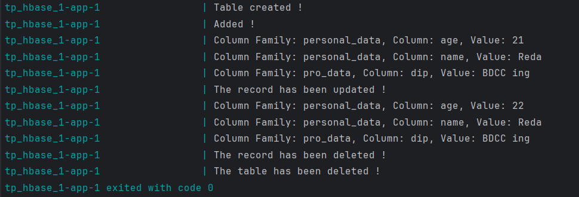

# BASIC APP USING HBASE | AUTHOR : ELMARRAKCHY Reda

## Creating the table :

````java
Connection connection = ConnectionFactory.createConnection(configuration);

Admin admin = connection.getAdmin();

TableName tableName = TableName.valueOf(TABLE_NAME);
TableDescriptorBuilder tableDescriptorBuilder = TableDescriptorBuilder.newBuilder(tableName);
tableDescriptorBuilder.setColumnFamily(ColumnFamilyDescriptorBuilder.of(CF_PERSONAL_DATA));
tableDescriptorBuilder.setColumnFamily(ColumnFamilyDescriptorBuilder.of(CF_PRO_DATA));

TableDescriptor tableDescriptor = tableDescriptorBuilder.build();

if (!admin.tableExists(tableName)) {
    admin.createTable(tableDescriptor);
    System.out.println("Table created !");
} else  {
    System.err.println("Already exist !");
}
````

## Inserting data :
````java
Table table = connection.getTable(tableName);
Put put = new Put(Bytes.toBytes("1"));
put.addColumn(Bytes.toBytes(CF_PERSONAL_DATA), Bytes.toBytes("name"), Bytes.toBytes("Reda"));
put.addColumn(Bytes.toBytes(CF_PERSONAL_DATA), Bytes.toBytes("age"), Bytes.toBytes("21"));
put.addColumn(Bytes.toBytes(CF_PRO_DATA), Bytes.toBytes("dip"), Bytes.toBytes("BDCC ing"));
table.put(put);
System.out.println("Added !");
````

## Reading data :
````java
public static void display(Result result) {
    for(Cell cell: result.rawCells()) {
        byte[] cf = CellUtil.cloneFamily(cell);
        byte[] qualifier = CellUtil.cloneQualifier(cell);
        byte[] value = CellUtil.cloneValue(cell);

        String cfString = Bytes.toString(cf);
        String qualifierString = Bytes.toString(qualifier);
        String valueString = Bytes.toString(value);

        System.out.println("Column Family: " + cfString +
        ", Column: " + qualifierString +
        ", Value: " + valueString);
    }
}

Get get = new Get(Bytes.toBytes("1"));
Result result = table.get(get);

display(result);
````

## Updating data :
````java
put = new Put(Bytes.toBytes("1"));
put.addColumn(Bytes.toBytes(CF_PERSONAL_DATA), Bytes.toBytes("name"), Bytes.toBytes("Reda"));
put.addColumn(Bytes.toBytes(CF_PERSONAL_DATA), Bytes.toBytes("age"), Bytes.toBytes("22"));
put.addColumn(Bytes.toBytes(CF_PRO_DATA), Bytes.toBytes("dip"), Bytes.toBytes("BDCC ing"));
table.put(put);

System.out.println("The record has been updated !");

get = new Get(Bytes.toBytes("1"));
result = table.get(get);

display(result);
````

## Deleting data :
````java
Delete delete = new Delete(Bytes.toBytes("1"));
table.delete(delete);

System.out.println("The record has been deleted !");
````

## Deleting the table :
````java
admin.disableTable(tableName);
admin.deleteTable(tableName);

System.out.println("The table has been deleted !");
````

## Demo :
